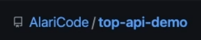

docker-compose -f docker-compose.yml -f docker-compose.dev.yml up -d

docker ps

docker-compose -f docker-compose.yml -f docker-compose.dev.yml config

docker-compose config

docker search node

https://github.com/AlariCode/top-api-demo

docker login https://github.com/users/AlariCode/packages/container/package/top-api-demo%2Ftop-api-demo

docker login https://ghcr.io -u gayratv --password-stdin
cat token.txt | docker login https://ghcr.io -u gayratv --password-stdin

docker pull ghcr.io/alaricode/top-api-demo/top-api-demo:develop

# домен/пользователь/репозиторий/название контейнера
docker tag alaricode-docker-api:latest ghcr.io/gayratv/alaricode-docker/api-test:latest

docker images

docker push ghcr.io/gayratv/alaricode-docker/api-test
